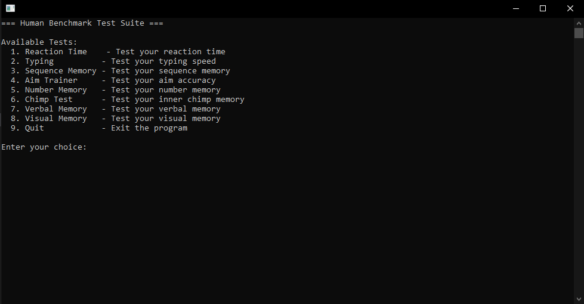

# Human Benchmark
### 🚧 Under development 🚧
A CLI tool written in Rust and optimized for Windows (x86) with scripts to beat every [Human Benchmark](https://humanbenchmark.com/) test.

Human Benchmark is a website where you can do multiple tests to see how you compare to other humans in areas like reaction time, memory, typing speed, and more. Doing these tests yourself is fun, but it is even more fun to see how far you can push those tests using your computer to do the hard work ;)

## Installation
Whichever installation method you choose, make sure you have [Chrome](https://www.google.com/chrome/) installed.

### Simple
1. Download the latest Windows x86 executable from the releases page (**Coming Soon**)
2. Run the executable

### Advanced
1. Install [Rust](https://www.rust-lang.org/tools/install)
2. Clone the repository
3. Run in debug mode with `cargo run main.rs` or run in release mode with `cargo run --release main.rs` (Performance difference is negligible)

## Usage
When you run the executable, you are greeted with an overview of the available tests. By typing a number, you can select the test you want to run. After pressing enter, an automated Chrome instance is launched for the test, and the script will complete the test for you.

## Showcases
### Reaction Time
https://github.com/user-attachments/assets/92da8a8b-4625-47cf-87ab-b5a0978f3d2b

### Typing
https://github.com/user-attachments/assets/6ec1e134-a56b-4a70-a770-8a993f9ac512

### Sequence Memory
🚧 Under development 🚧

### Aim Trainer
https://github.com/user-attachments/assets/4fb68d11-0dc7-494e-aa30-38bb1de49afb

### Number Memory
🚧 Under development 🚧

### Chimp Test
https://github.com/user-attachments/assets/54e742a6-7b50-4ff3-8c89-a72169e6184c

### Verbal Memory
https://github.com/user-attachments/assets/33dc4880-01fd-4088-b71a-dba19c162353

### Visual Memory
🚧 Under development 🚧

## Crates
- [headless_chrome](https://crates.io/crates/headless_chrome) for launching a automated Chrome instance, retrieve HTML content from the page and perform click actions in non-performance-critical sections
- [win32api](https://crates.io/crates/win32api) for performance-critical actions like positioning the mouse cursor, performing mouse clicks, and performing keyboard actions
- [scraper](https://crates.io/crates/scraper) for parsing HTML content

